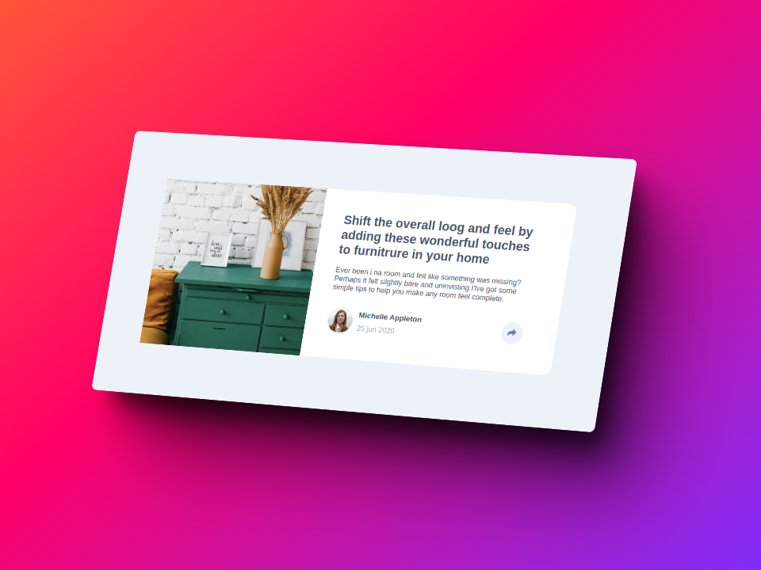
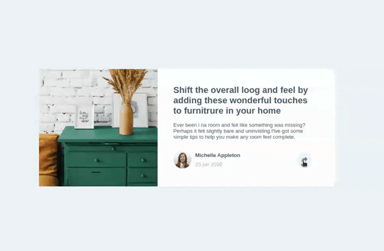
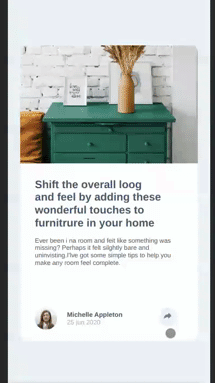

# Card animación sin JS | MENDOZALZ (Colaboración MENZDEV)

  

  

  

Ver en [Vercel](https://componente-de-perfil.vercel.app/)

## 🚀 Card de perfil

Una sencilla card de perfil animada sin JS simulando un evento toggle

## Descarga

Solo debes copiar el repositorio tal como muestra la imagen

  

luego ve a la terminal y haz un git clone tal como muestra la imagen

  

Ingresas a la carpeta descargada (clonada) y lo despliegas con Live Server

## Happy Coding

Sientete libre de hacer los cambios que creas pertinentes.
